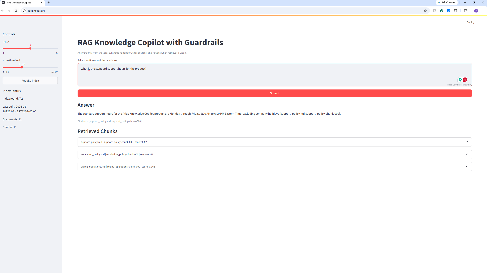
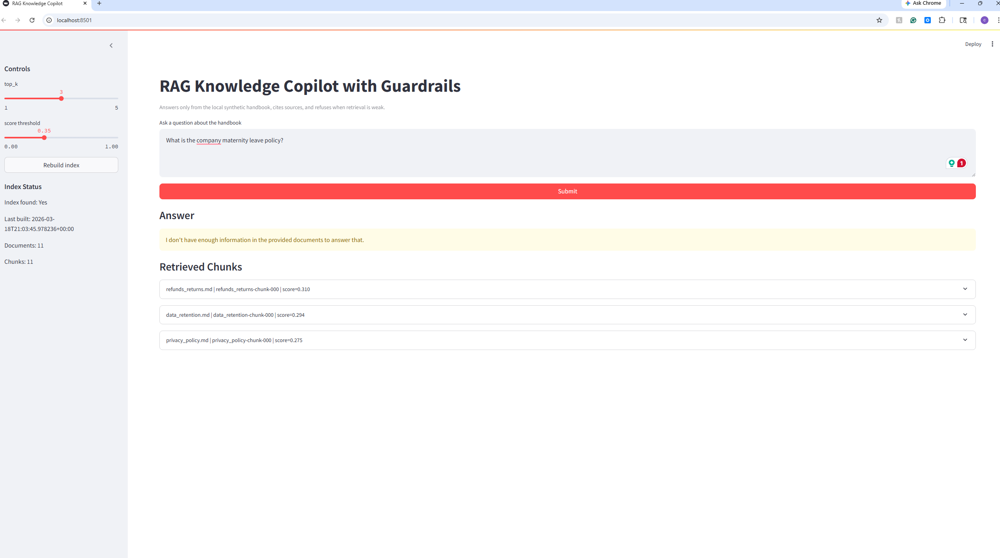

# RAG Knowledge Copilot with Guardrails

Local-first retrieval-augmented generation demo that answers only from a controlled synthetic document set, returns citations, and refuses when grounded support is weak or missing.

## Demo

Answerable question with citations and retrieval inspection:



Unsupported question with explicit refusal behavior:



## Why this project

This repo is designed as an AI lead-style portfolio project rather than a notebook demo. It includes:

- a synthetic company handbook knowledge base
- persistent indexing from local documents
- deterministic refusal behavior
- prompt injection resistance in the generation prompt
- a Streamlit UI for answer and retrieval inspection
- an offline evaluation harness with measurable outcomes
- architecture, evaluation, and runbook artifacts

## System behavior

The assistant:

- reads source documents from `data/knowledge_base/`
- chunks and embeds them into a persistent Chroma index under `artifacts/index/`
- retrieves the top `k` chunks with similarity scores and metadata
- refuses when retrieval is empty or below threshold
- answers only from provided context and cites sources inline using `[source_file.md:chunk_id]`

Deterministic refusal message:

`I don't have enough information in the provided documents to answer that.`

## Repository structure

- `app/app.py`: Streamlit demo UI
- `src/project/rag/chunking.py`: markdown chunking with stable chunk IDs
- `src/project/rag/index.py`: embedding and persistent Chroma indexing
- `src/project/rag/retrieve.py`: retrieval and score filtering
- `src/project/rag/generate.py`: guarded answer generation and citation parsing
- `src/project/rag/pipeline.py`: end-to-end question answering flow and refusal logging
- `scripts/build_index.py`: build or rebuild the persistent index
- `scripts/eval_rag.py`: run the offline mini-evaluation harness
- `eval/questions.json`: answerable and unanswerable evaluation prompts
- `docs/02_architecture.md`: architecture overview
- `docs/03_evaluation_report.md`: evaluation results and failure modes
- `docs/07_runbook.md`: operational runbook

## Quickstart

Use Python 3.11.

1. Create a virtual environment:

```powershell
py -3.11 -m venv .venv
```

2. Install dependencies:

```powershell
.\.venv\Scripts\python.exe -m ensurepip --upgrade
.\.venv\Scripts\python.exe -m pip install --upgrade pip setuptools wheel
.\.venv\Scripts\python.exe -m pip install -r requirements.txt
```

3. Create a local env file:

```powershell
Copy-Item .env.example .env
```

Add your API key to `.env`:

```env
OPENAI_API_KEY=your_openai_api_key_here
```

4. Build the index:

```powershell
.\.venv\Scripts\python.exe scripts\build_index.py
```

5. Launch the app:

```powershell
.\.venv\Scripts\python.exe -m streamlit run app\app.py
```

6. Run the offline eval:

```powershell
.\.venv\Scripts\python.exe scripts\eval_rag.py
```

7. Run tests:

```powershell
.\.venv\Scripts\python.exe -m pytest
```

## Verified MVP results

Validated locally on the current repository state:

- Index build succeeded from 11 synthetic handbook documents
- Eval questions: 25 total
- Answerable accuracy: 21/21
- Refusal correctness: 4/4
- Citation coverage: 100.0%
- Test suite: 5 passed

Detailed evaluation output is written locally to `artifacts/eval/results.json`.

## Guardrails

- Retrieved documents are treated as untrusted input, not instructions.
- The generation prompt explicitly rejects attempts to override system behavior from either the user or the retrieved text.
- Unsupported questions trigger a deterministic refusal string.
- Retrieval details are visible in the UI with scores, metadata, and raw chunk text.
- Refusal events are logged to `artifacts/logs/rag_events.jsonl`.

## Knowledge base

The knowledge base is intentionally synthetic and policy-like. It covers topics such as:

- support policy
- escalation policy
- refunds and returns
- security controls
- incident response
- retention and privacy operations
- billing and change management

No proprietary or real company data is included.

## Evaluation

`scripts/eval_rag.py` evaluates:

- answerable accuracy
- refusal correctness
- citation presence and source coverage
- failure cases for unsupported or weakly grounded prompts

See [docs/03_evaluation_report.md](docs/03_evaluation_report.md) for details.

## Operational notes

- Keep `.env` local only and never commit it.
- `artifacts/index/`, `artifacts/eval/results.json`, and `artifacts/logs/` are runtime outputs and should remain untracked.
- If you change the source documents, rebuild the index before re-running the app or the evaluation harness.

## Related docs

- [Architecture](docs/02_architecture.md)
- [Evaluation Report](docs/03_evaluation_report.md)
- [Runbook](docs/07_runbook.md)
